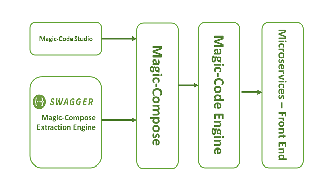

# ***Magic-Code***
  

Need to create microservices with right set of tools and frameworks? Then **Magic-Code** is the framework to ease you out.
***Magic-Code*** provides a platform to generate scalable microservices using opinionated frameworks and tools, Latest features of different frameworks are stitched together to give you a jump start, So that you are focused on your business logic instead of figuring out which tools to use and how to enable them in your project.

## ** ***Magic-Code*** generated code features** 

!!! note ""
        
    * **REST endpoints**
        * Controller classes
        * Circuit breaker pattern
        * Monitoring of your endpoints
    * **Monitoring using Micrometer**
        * Monitor system metrics
        * Monitor thread level metrics
        * Database connection pool monitoring
        * Monitor your rest endpoints
        * Export monitoring data with ease to
            * JMX
            * Prometheus
            * Atlas
            * Graphite
            * Data Dog
    * **POJO/DTO classes**
        * USe primitive Java types as well asa user defined Object types as fields
        * Use container type (List and Array) as fields
    * **Entity Classes** 
        * Use primitive Java types as fields/columns in your entities
        * Create relationships/associations between your entities
        * Enable Caching for your entities
        * Auto genrate Spring Data JPA repositories for your entities
    * ***Mappers and Transformers(Work In Progress)***

## ** ***Magic-Code*** Supported Tools and Frameworks ** 

!!! note ""
    * **Server side frameworks**

        * Spring Boot
        * Spring Data JPA
        * Spring Security
        * Client Side Load Balancing
        * Spring Cloud Configurations
        * Service Discovery & registration

    * **Client side frameworks**

        * HTML 5
        * Bootstrap
        * Angular
        * JQuery
        
## **Components of Magic-Code framework**

### **Magic-Compose**
The heart and soul of Magic-Code framework is a ***Magic-Compose*** JSON file. It contains all information required by the ***Magic-Compose Engine*** to generate the server side and client side code. Each and every information in this file is just JSOn configuration. You can control each and every option of the generated code from this file itslef.

### **Magic-Code Engine**
This is the core engine responsible for generating the code from client side and server side. It understands the ***Magic-Code***. And based on ***Magic-Compose*** you supply as input it performs just like magic for you.

### **Magic-Compose Studio (Work in progress)**
To generate the ***Magic-Compose*** file you are free to use any of the JSON tool or you can create it manually using any of your favourite editor. We suggest using ***Magic-Compose Studio*** which will guide you intuitively and will provide options so that you can easily create the ***Magic-Compose*** file.

### **Magic-Compose Extraction Engine**
    
If you have your definitions in other formats then your works needs not to be lost. We do support extraction of ***Magic-Commpose*** file from other common formats. Currently we support below option to extract from.
* Swagger
* Database (In progress).
---
## **The generated contents are**

#### **Server side code**

Using magic code you can generate server side code within minutes and wihout hassels. All you need to do is provide the engine with ***Magic-Compose*** file, and it realy does the magic for you by generating server side scaffolding code and that too within minutes following industry wide best practices and production grade code.

#### **Responsive user interface**

Based on the inputs provided by you in ***Magic-Compose*** format the Magic-Code engine generates responsive user interface based on selected front end option.

